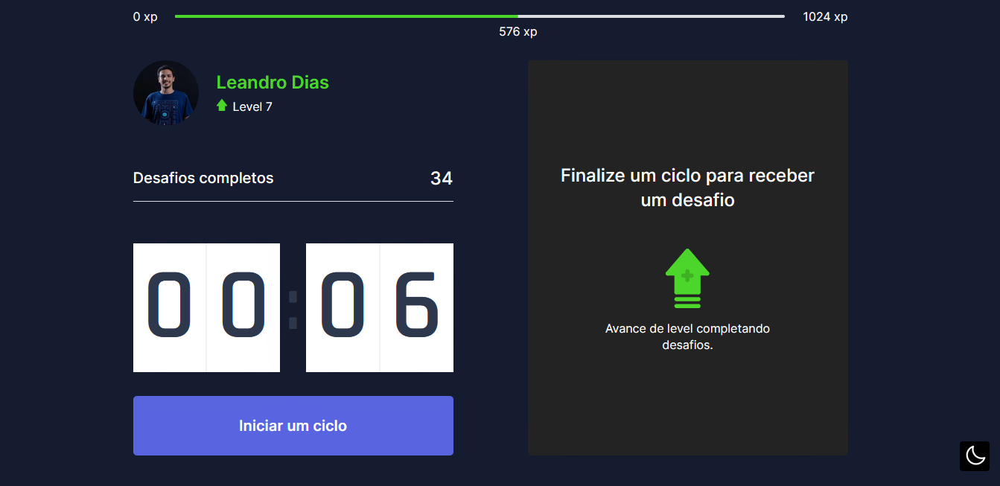
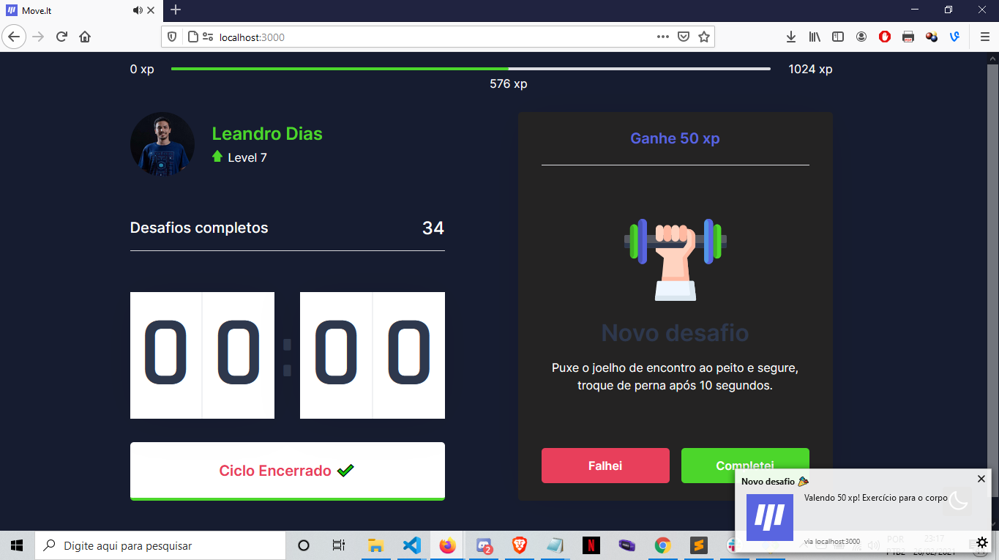
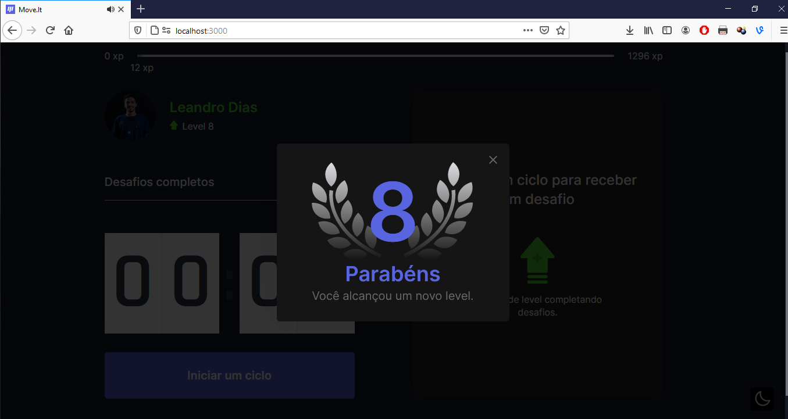

# MOVEIT

[](https://github.com/leandrodiasme)
[](https://github.com/leandrodiasme/Moveit)
[](https://github.com/leandrodiasme/Moveit)
[](https://choosealicense.com/licenses/mit/)

## Table of Content

- [ Project Links ](#Project-Links)
- [ Screenshots-Demo ](#Screenshots)
- [ Project Objective ](#Project-Objective)
- [ User Story ](#User-Story)
- [ Technologies ](#Technologies)
- [ Installation ](#Installation)
- [ Usage ](#Usage)
- [ Credits and Reference ](#Credits-and-Reference)
- [ Tests ](#Tests)
- [ Author Contact ](#Author-Contact)
- [ License ](#License)

#

## Project Links

https://github.com/leandrodiasme/Moveit<br>

## Screenshots-Demo

<kbd></kbd><kbd></kbd><kbd></kbd>

## Project Objective

Moveit is an application that aims to take care of the well-being of users who spend a lot of time in front of the computer. Every 30 minutes the application issues a pause notification for an exercise (which reinforces the health of the eyes or body). The user gains XP for each completed exercise.

## User Story

Once the user performs exercises proposed by the application, he level up (via xp) .

## Technologies

```
Javascript, Reactjs, Nextjs
```

## Installation

The application is online and the user can access it at: https://moveit-dusky-one.vercel.app/

## Usage

Start a cycle, wait for the countdown and perform the exercises to advance the level!

## Credits and Reference

https://rocketseat.com.br/

## Tests

Accessing the application online at: https://moveit-dusky-one.vercel.app/

## Author Contact

Contact the author with any questions!<br>
Github link: [leandrodiasme](https://github.com/leandrodiasme)<br>
Email: leandrodias.me@gmail.com

## License

This project is [MIT](https://choosealicense.com/licenses/mit/) licensed.<br />

Copyright © 2021 [LEANDRO DIAS](https://github.com/leandrodiasme)

  <hr>
  <p align='center'><i>
  This README was generated with ❤️ by LEANDRO DIAS
  </i></p>
